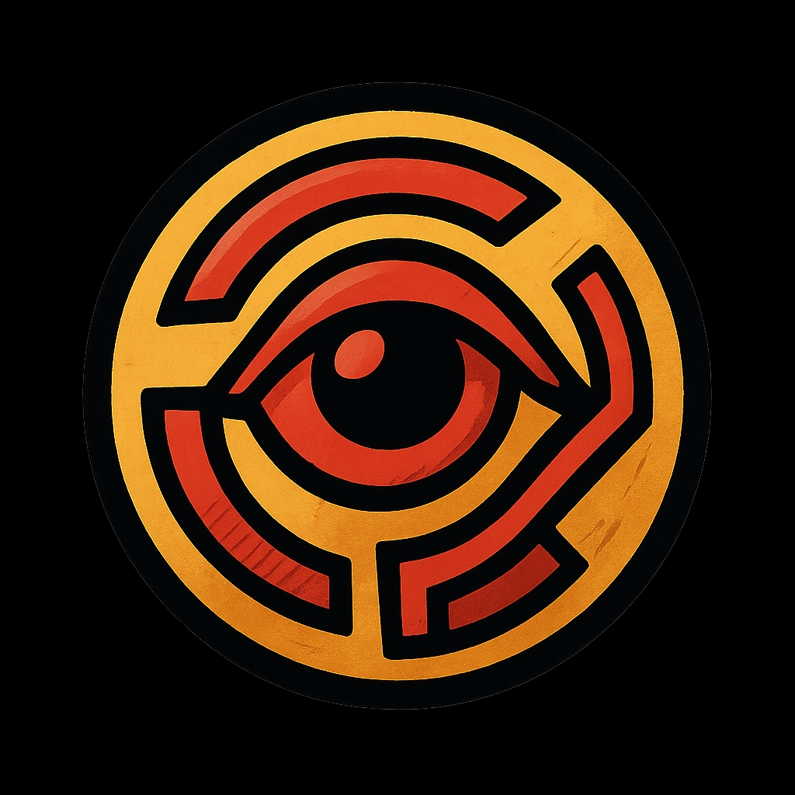

# 🎯 Panoptic

<!-- Panoptic Logo -->
<div align="center">
  
</div>

<div align="center">

[](https://golang.org)
[](LICENSE)
[](https://github.com/your-org/panoptic/actions)
[](docs/COVERAGE_REPORT.md)
[](https://goreportcard.com/report/github.com/your-org/panoptic)

**Comprehensive Automated Testing & Recording Framework**

A powerful, multi-platform testing solution for web, desktop, and mobile applications with advanced UI automation, screenshot capture, and video recording capabilities.

</div>

## 📋 Table of Contents

- [Features](#-features)
- [Quick Start](#-quick-start)
- [Installation](#-installation)
- [Usage](#-usage)
- [Configuration](#-configuration)
- [Platform Support](#-platform-support)
- [Advanced Features](#-advanced-features)
- [Examples](#-examples)
- [Testing](#-testing)
- [Contributing](#-contributing)
- [License](#-license)

## 🚀 Features

- **Multi-Platform Support**: Web, Desktop, and Mobile automation
- **Advanced UI Automation**: Element detection and interaction
- **Screenshot Capture**: High-quality screenshots with timestamping
- **Video Recording**: Session recording with multiple formats
- **Test Framework**: Comprehensive testing with assertions
- **Cross-Browser**: Chrome, Firefox, Safari, Edge support
- **Mobile Support**: iOS and Android automation
- **CI/CD Integration**: Easy integration with CI/CD pipelines
- **Extensible Architecture**: Plugin system for custom functionality

## 🏁 Quick Start

```bash
# Install Panoptic
go install github.com/your-org/panoptic@latest

# Run your first test
panoptic test example_test.go

# Record a session
panoptic record --output session.mp4
```

## 📦 Installation

### Prerequisites

- Go 1.21 or higher
- Chrome/Chromium (for web automation)
- Xcode (for iOS automation)
- Android SDK (for Android automation)

### From Source

```bash
git clone https://github.com/your-org/panoptic.git
cd panoptic
make install
```

### Using Go

```bash
go get github.com/your-org/panoptic
```

## 💻 Usage

### Basic Test Example

```go
package main

import (
    "github.com/your-org/panoptic"
    "github.com/your-org/panoptic/web"
)

func main() {
    // Create a new browser instance
    browser, _ := web.NewBrowser()
    
    // Navigate to a website
    browser.Navigate("https://example.com")
    
    // Take a screenshot
    browser.Screenshot("screenshot.png")
    
    // Close browser
    browser.Close()
}
```

### Recording a Session

```bash
# Record a web session
panoptic record --platform web --url https://example.com --output demo.mp4

# Record a mobile session
panoptic record --platform ios --device iPhone13 --output mobile_demo.mp4
```

## ⚙️ Configuration

Panoptic uses a configuration file (`panoptic.yaml`) for advanced settings:

```yaml
# panoptic.yaml
browser:
  headless: false
  viewport: "1920x1080"
  timeout: 30s

recording:
  format: "mp4"
  quality: "high"
  fps: 30

mobile:
  ios:
    device: "iPhone13"
    xcode_path: "/Applications/Xcode.app"
  android:
    device: "Pixel_3_API_30"
    adb_path: "/usr/local/bin/adb"
```

## 📱 Platform Support

| Platform | Status | Features |
|----------|--------|----------|
| Web | ✅ | Full automation, screenshots, recording |
| iOS | ✅ | App automation, screen recording |
| Android | ✅ | App automation, screen recording |
| Desktop | ✅ | UI automation, screen capture |

## 🛠️ Advanced Features

### Custom Selectors

```go
// Custom CSS selector
element := browser.FindElement("button.submit")

// XPath selector
element := browser.FindElementByXPath("//button[@type='submit']")
```

### Wait Strategies

```go
// Wait for element to appear
browser.WaitForElement("div.loading", 10*time.Second)

// Wait for condition
browser.WaitForCondition(func() bool {
    return browser.FindElement("button").Visible()
}, 15*time.Second)
```

### Hooks and Plugins

```go
// Before hook
panoptic.AddHook("before_test", func() {
    // Setup code
})

// After hook
panoptic.AddHook("after_test", func() {
    // Cleanup code
})
```

## 📖 Examples

### Web Testing

```go
func TestLogin(t *testing.T) {
    browser, _ := web.NewBrowser()
    defer browser.Close()
    
    browser.Navigate("https://login.example.com")
    
    // Fill form
    browser.FindElement("#username").Type("testuser")
    browser.FindElement("#password").Type("password123")
    browser.FindElement("button[type='submit']").Click()
    
    // Verify login
    browser.WaitForElement(".dashboard", 10*time.Second)
    
    // Take screenshot
    browser.Screenshot("login_success.png")
}
```

### Mobile Testing

```go
func TestMobileApp(t *testing.T) {
    // Connect to device
    device, _ := mobile.NewDevice("ios")
    defer device.Close()
    
    // Launch app
    device.Launch("com.example.app")
    
    // Interact with elements
    device.Tap("login_button")
    device.Type("username_field", "testuser")
    device.Type("password_field", "password123")
    
    // Verify result
    device.WaitForElement("welcome_screen", 15*time.Second)
}
```

## 🧪 Testing

Run the test suite:

```bash
# Run all tests
make test

# Run with coverage
make test-coverage

# Run specific test
go test -run TestLogin
```

## 🤝 Contributing

We welcome contributions! Please see our [Contributing Guide](CONTRIBUTING.md) for details.

### Development Setup

```bash
# Fork and clone the repository
git clone https://github.com/your-org/panoptic.git
cd panoptic

# Install dependencies
make deps

# Run development server
make dev
```

## 📄 License

This project is licensed under the MIT License - see the [LICENSE](LICENSE) file for details.

---

<div align="center">

[](https://github.com/your-org/panoptic)
[](https://github.com/your-org/panoptic)
[](https://github.com/your-org/panoptic)

Made with ❤️ by the Panoptic team

</div>
